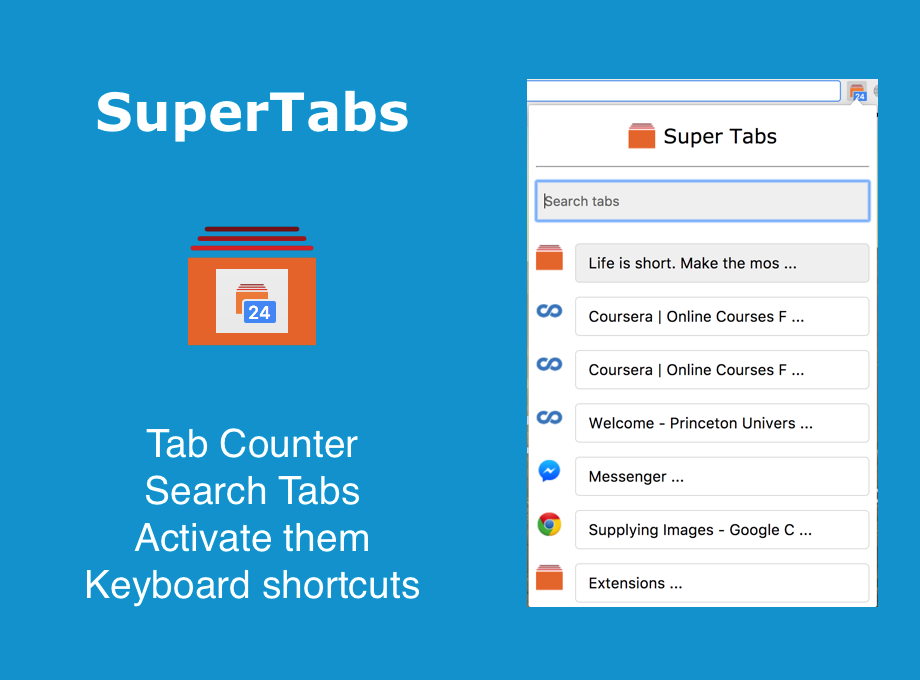

# SuperTabs
---

List and search through your open tabs with ease! 

Familiar scene? No worries anymore. 

## Demo

## Introduction

A superuser tool to acomplish your tasks and internet surfing faster. No more scrolling over tabs that you can't even read their titles. Easily list them and search them. 

## Features

- See number of open tabs across all windows as the badge counter 
- List all open tabs
- Search through titles and urls of the tabs and quickly switch them by clicking on them.
- Keyboard shortcuts: Press Cmd+E (Win: Ctrl+E) to activate the pop up.

## Permissions
- Tabs permission: To access currently open tabs and their url and titles.

No network or other permissions are used. 

## FEEDBACK AND BUGS
Please report all your valuable feedback, feature requests and bug reports on the github issues page.

## Release notes

- 2018.05.28 - v.1.0.1:
  - Stable release
  - Global shortcut to Cmd+E (Win: Ctrl+E)
  - Add usage tutorial video
- 2018.04.30 - v1.0.0 - Pop up issue resolved.
- 2018.01.13 - v.0.0.1 - Initial release.

## ACKNOWLEDGEMENTS

- Icon made by <a href="https://www.flaticon.com/authors/smashicons" title="Smashicons">Smashicons</a> 